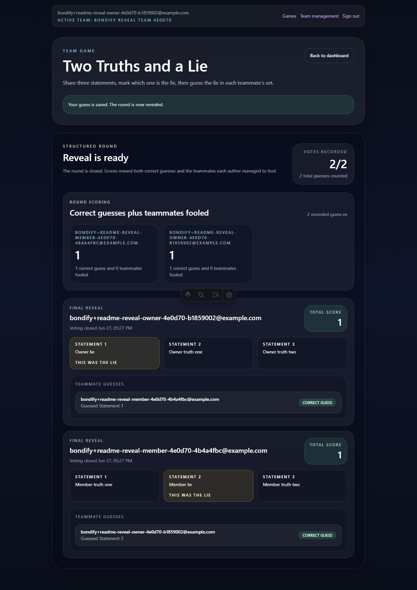

# Bondify

Bondify helps newly formed teams build rapport through quick, repeatable micro-games that fit naturally into standups, kickoffs, and short check-ins.

## Product Summary

The MVP centers on one core flow:

- A user signs in with OAuth
- A user creates a team and adds teammates by username
- Any team member opens a micro-game
- Each participant submits one anonymous response
- The team sees all responses together on a shared results screen

The goal is to create lightweight daily rituals that improve trust and reduce early-team friction without adding meeting overhead.

## Current Status

This repository contains the Bondify Astro application and the supporting planning artifacts for the MVP.

- Astro app is scaffolded and configured for SSR on Cloudflare Workers
- Product and stack planning docs are in place under `context/`
- First production deployment is live at `https://bondify.witkos4.workers.dev`
- Cloudflare-managed production deploys from `main` are enabled

## Planned Stack

- Starter: 10x Astro Starter
- Language family: JavaScript
- Package manager: npm
- Deployment target: Cloudflare Workers
- CI provider: GitHub Actions

## Deployment Model

- Runtime and deploy target: Cloudflare Workers
- First production release: manual deploy to `*.workers.dev` via `wrangler`
- Ongoing production deploys: Cloudflare Workers Builds / Git integration on pushes to `main`
- GitHub Actions role: CI only (`lint` and `build`), not release execution
- Worker URL behavior: `workers_dev` and preview URLs are explicitly enabled in `wrangler.jsonc`

## Repository Layout

- `context/foundation/shape-notes.md` - shaping notes for the product
- `context/foundation/prd.md` - MVP product requirements
- `context/foundation/tech-stack.md` - selected stack and starter hand-off
- `context/changes/` - workflow artifacts for tracked changes
- `context/archive/` - archived change records

## MVP Principles

- Fast enough for short team rituals
- Minimal friction between opening the app and participating
- Anonymous responses by default
- Shared reveal as the core team moment
- Mobile web support from the start

## Next Step

Continue MVP feature development. For local app work, start local Supabase and run `npm run dev:local -- --host 127.0.0.1 --port 4321`.
